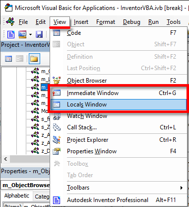
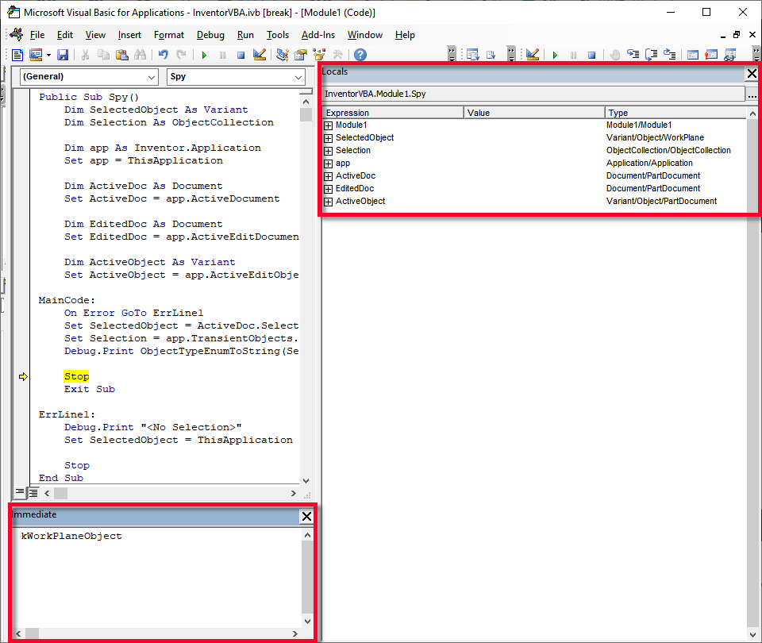

# Inventor VBA Object browser

This article is based on [Object Browser for Inventor](http://forums.autodesk.com/t5/inventor-ilogic-and-vb-net-forum/object-browser-for-inventor/td-p/10671266) topic on Inventor iLogic and VB.net Forum. 

This VBA code may help you to find the right way, how to obtain the correct value from complex Inventor object model.

## Setup

1) Open VBA editor
1) Copy the [code](#spy-method-code-vba) to new VBA module in application project. Or you can import the code from [m_ObjectBrowser.bas](m_ObjectBrowser.bas) file
1) Generate `ObjectTypeEnumToString` (optional)
    a) Create new document in Inventor
    a) Navigate to iLogic editor
    a) Create new rule
    a) Copy [code](#-GenerateObjectTypeEnumToString.iLogicVb) to new rule from this snippet. Or download external rule here [GenerateObjectTypeEnumToString.iLogicVb](GenerateObjectTypeEnumToString.iLogicVb)
    a) Save and Run the rule
    a) Go to the VBA module below `Spy` method
    a) Paste clipboard content
    a) Close the document. You don't need them anymore.
1) Save VBA project
1) Show the Immediate and Locals windows




## Usage

1) Select some object(s) in Inventor
1) Go to VBA editor
1) Run the macro Spy(). You can use one of the following methods:
    a) Navigate to the method in module and press `F5`
    a) Type `Spy` to the Immediate window and press `Enter`
1) Look in to the Locals window
1) Expand appropriate node and look what is inside
1) Repeat step 5. until you find what do you want :)
 


 ## Code snippets

### Spy method code (VBA)

```vb
Public Sub Spy()
    Dim SelectedObject As Variant
    Dim Selection As ObjectCollection
    
    Dim app As Inventor.Application
    Set app = ThisApplication
    
    Dim ActiveDoc As Document
    Set ActiveDoc = app.ActiveDocument
    
    Dim EditedDoc As Document
    Set EditedDoc = app.ActiveEditDocument
    
    Dim ActiveObject As Variant
    Set ActiveObject = app.ActiveEditObject
    
MainCode:
    On Error GoTo ErrLine1
    Set SelectedObject = ActiveDoc.SelectSet.Item(1)
    Set Selection = app.TransientObjects.CreateObjectCollection(ActiveDoc.SelectSet)
    Debug.Print ObjectTypeEnumToString(SelectedObject.Type)

    Stop
    Exit Sub
    
ErrLine1:
    Debug.Print "<No Selection>"
    Set SelectedObject = ThisApplication
   
    Stop
End Sub
``` 

### GenerateObjectTypeEnumToString.iLogicVb
```vb
Dim code As New System.Text.StringBuilder
Dim ote = ThisDoc.Document.Type
Dim oteType As Type = ote.GetType()
code.AppendLine("Function ObjectTypeEnumToString(t as ObjectTypeEnum) As String")
code.AppendLine("   Select Case t")
For Each value In [Enum].GetValues(oteType)
	Dim name = [Enum].GetName(oteType, value)
	code.AppendFormat("      Case {0}: ObjectTypeEnumToString = ""{1}"": Exit Function{2}", value, name, vbCrLf)
Next
code.AppendLine("   End Select")
code.AppendLine("End Function")
System.Windows.Forms.Clipboard.SetText(code.ToString())
MsgBox("Code is in clipboard", Title :="ObjectTypeEnumToString")
```